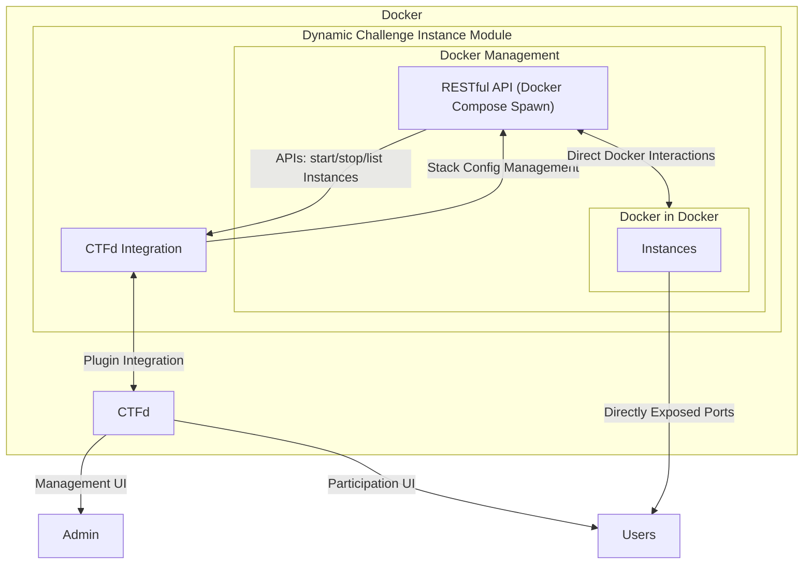

# CTFd-DCI

## Architecture



## Testing

Start the test server:

```shell
docker compose up
```

## TODOs

- [ ] Admin modifying configuration
- [ ] Admin listing all instances
- [ ] Admin creating `dynamic instance` challenge
  - [ ] Admin uploading stack configuration
- [ ] Admin updating `dynamic instance` challenge
- [ ] Scheduled cleaning up expired instances every minute
- [ ] User participating in a `dynamic instance` challenge

## Contributing

Please feel free to contribute to this project. Any help is appreciated. But please make sure to follow [Conventional Commits](https://www.conventionalcommits.org/en/v1.0.0/).
